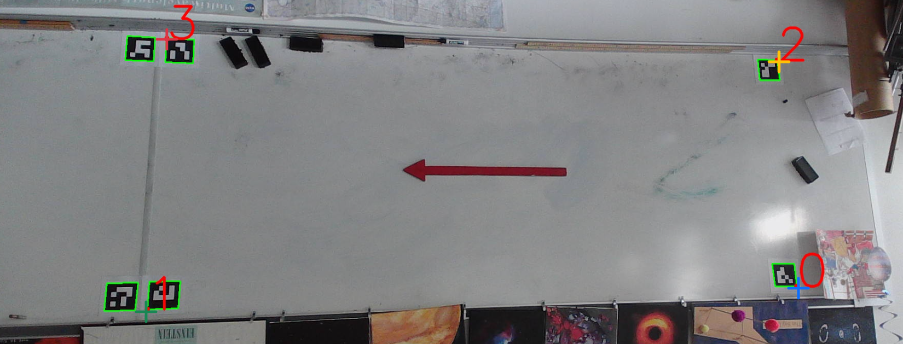

# Whiteboard Recorder

## A recording system that creates a birds-eye view of a whiteboard recorded from any perspective

Whiteboard Recorder captures high-resolution video of multiple whiteboards while still allowing for flexible camera placement.
It provides a non-intrusive solution for archiving lessons and lectures to aid students that missed class.


## Requirements

- Python 3
- Network connection for installation only

### Reccomended hardware

- A capable computer with the software requirements installed
- A webcam with a decently high resolution (preferably 1920x1080 or better)
- A microphone
- (Optional) A USB cable extender rated for the USB version that the camera communicates with, to mount the camera far from the computer
- (Optional) A USB hard drive, SSD, or even flash drive/SD card that is either high endurance or disposable for storing recordings

## Installation

### Install node via nvm

As explained in full detail at [https://github.com/nvm-sh/nvm](https://github.com/nvm-sh/nvm), run the following commands to install node using nvm.

1. Run `curl -o- https://raw.githubusercontent.com/nvm-sh/nvm/v0.39.5/install.sh | bash` to download and install nvm
2. Close and reopen your terminal
3. Ensure that `command -v nvm` returns `nvm`
4. Install the latest version of node using `nvm install node`

### Whiteboard Recorder Setup

1. Use `git clone https://github.com/PicoPlanetDev/whiteboard-recorder` to download the source code
2. `cd whiteboard-recorder` then
3. `cd frontend` then `npm install`
4. `cd ../backend` then create a virtual environment `venv` in the backend directory
   - On Windows: `python -m venv venv` and activate the venv with `.\venv\Scripts\activate`
   - On Linux: `python3 -m venv venv` and activate the venv with `source venv/bin/activate`
5. Install the required packages
   - On Windows: `pip install -r requirements.txt`
   - On Linux: `pip3 install -r requirements.txt`
6. Install required software:
   - On Windows: Place `ffmpeg.exe` in the `whiteboard-recorder/backend` directory
   - On Linux: `sudo apt install -y ffmpeg v4l-utils`
7. Copy `.env.example` to `.env` and modify it for your configuration if necessary
   - If you are simply accessing Whiteboard Recorder over HTTP on your local network (or with a service such as Tailscale), there's no need to further modify `.env`
   - If you are setting up access to Whiteboard Recorder on a custom domain (or subdomain) using a reverse proxy or a service such as a Cloudflare Tunnel, the `VITE_API_ENDPOINT` variable must be modified to match your domain configuration, with `/api` added on to the end. This variable must be in quotation marks as well, such as `"https://whiteboard-recorder-api.mydomain.com/api"`.

## Usage

This will be updated once the built webapp is released and I make a simple start script, but in the meantime, just use the dev servers as follows:

1. `cd` into the `whiteboard-recorder` directory
2. Create a second terminal emulator tab/window in the same directory
3. In the first terminal: `cd frontend` then `npm run dev -- --host`
4. In the second terminal: `cd backend` then
   - On Windows: `.\venv\Scripts\activate` then `python app.py`
   - On Linux: `source venv/bin/activate` then `python3 app.py`
5. Navigate in a modern browser to `http://localhost:5173`
   - To control Whiteboard Recorder from another device, replace `localhost` with the host computer's local IP address
6. Select **Settings** in the navbar and select your microphone and camera(s), then setup their respective parameters as necessary.
   - On Linux, it is necessary to manually enter the audio and video devices. Use `arecord -L` to see the available audio inputs, and `v4l2-ctl --list-devices` to see available video devices
7. Configure the bird's eye perspective warp using the **Launch video configurator** button:
   1. Select the video device you want to set up
   2. Click **Capture frame** to get an image for reference
   3. Click the top left corner of the whiteboard
   4. Select the colored arrow button for the top right corner, then click the image again to set that corner
   5. Repeat this process for the two remaining corners
   6. Click **Save** then **Preview warped**
   7. Make any changes you need and save again, repeat the process for another camera, or close the dialog and continue
8. Return to the root page by selecting **Home** in the navbar, then begin a recording with the **Start recording** button
9. End the recording by clicking the **Stop recording** button.
10. The recording is processed automatically, then will be available by clicking the **Download recording** button.

### Detect corners using ArUco markers

If you place ArUco markers on the corners of each whiteboard in the following pattern, Whiteboard Recorder can automatically detect the corners of the whiteboards.
The practical upshot of this is that even if cameras are bumped or jostled between recording sessions, the system can auto-calibrate without the need for more human interaction.

**ArUco marker layout**
```
0               1    4                5
 ______________        ______________
 |            |        |            |
 |    LEFT    |        |   RIGHT    |
 |____________|        |____________|
2               3    6                7
```

You'll need the first eight (id 0-7) ArUco markers from the 4x4 dictionary to be printed at a reasonable scale that details are clearly visible to the cameras.

A printable template I created for this purpose is available here:
[Printable ArUco Markers for Whiteboard Recorder](https://docs.google.com/document/d/1pYTUfZgqdmznR3uBIGijUz3qgU8xhxlHK0d828I7Mfw/edit?usp=drive_link)

Alternatively, you may generate your own marker images using an online generator (remember to keep whitespace around the marker), or using the supplied Python script in the `backend` directory.

1. Ensure that all dependencies are already installed (Whiteboard Recorder is already up and running)
2. Change to the `backend` directory: `cd PATH/TO/whiteboard-recorder/backend`
3. Activate the virtual environment: `source venv/bin/activate`
4. Run the script with `python3 arucogen.py`
5. Repeatedly press any key to iterate through the necessary IDs

To customize `arucogen.py`, consider editing the `range(0,8)` statement to change which IDs are included. Or, to edit the markers themselves, change the arguments to the `generate_marker(...` function call as per the docstring for the function included above in the script.

The following screenshot is cropped for obfuscation but otherwise unaltered, demonstrating the utility of ArUco markers for corner detection.


### Run on boot

1. Edit `whiteboard-recorder-backend.service` and `whiteboard-recorder-frontend.service` to match your username and path to the `whiteboard-recorder` directory
2. Edit `frontend/start.sh` to match your username
3. Copy both service files to the `/etc/systemd/system` directory:

```bash
cp whiteboard-recorder-backend.service /etc/systemd/system/whiteboard-recorder-backend.service
cp whiteboard-recorder-frontend.service /etc/systemd/system/whiteboard-recorder-frontend.service
```

4. Enable and start the services using sysctl:

```bash
sudo systemctl enable whiteboard-recorder-backend.service
sudo systemctl enable whiteboard-recorder-frontend.service

sudo systemctl start whiteboard-recorder-backend.service
sudo systemctl start whiteboard-recorder-frontend.service
```
